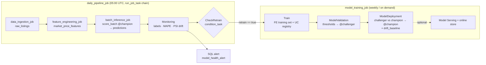

# Used Car Price Prediction — Databricks MLOps

An end-to-end, production-style MLOps project that predicts used car sale prices on Databricks.
It follows the Databricks MLOps guidance:

- [MLOps workflows on Databricks](https://docs.databricks.com/aws/en/machine-learning/mlops/mlops-workflow)
- [MLOps Stacks](https://docs.databricks.com/aws/en/machine-learning/mlops/mlops-stacks)
- [Feature Engineering in Unity Catalog](https://docs.databricks.com/aws/en/machine-learning/feature-store/uc/feature-tables-uc)
  and [point-in-time lookups](https://docs.databricks.com/aws/en/machine-learning/feature-store/time-series)
- [Data profiling / Lakehouse Monitoring](https://docs.databricks.com/aws/en/lakehouse-monitoring/)

The tooling matches the default MLOps Stack: Unity Catalog, Feature Engineering, MLflow, Jobs,
Declarative Automation Bundles (Asset Bundles), Model Serving, Lakehouse Monitoring, SQL alerts
and GitHub Actions.

## Architecture



| Step | What it does | Code |
|---|---|---|
| Ingest | Idempotent `MERGE` of listings into `raw_listings`, data quality gate, quarantine of bad rows | `data_ingestion/notebooks/IngestData.py` |
| Features | Time-series feature table `market_price_features`: trailing 30-day market stats per make/model/region (`MERGE`, optional online store publish) | `feature_engineering/notebooks/ComputeMarketFeatures.py` |
| Train | Point-in-time `FeatureLookup`, time-based holdout, gradient boosted model on `log(price)`, `fe.log_model` with feature lineage, Delta-version lineage, UC registration | `training/notebooks/Train.py` |
| Validate | MAPE/MAE/R² thresholds via `score_batch`, prediction sanity, signature and cold-start checks. Sets `@challenger` and audit tags | `validation/notebooks/ModelValidation.py` |
| Deploy | Compares challenger with champion on the latest window, promotes via `@champion`, writes the champion's `drift_baseline`. Optionally updates a serving endpoint | `deployment/model_deployment/notebooks/ModelDeployment.py` |
| Batch inference | `fe.score_batch(models:/…/<champion version>)` (features looked up automatically); idempotent `MERGE` into `predictions` | `deployment/batch_inference/notebooks/BatchInference.py` |
| Monitor | Label backfill, Lakehouse monitor (with baseline), MAPE, PSI data/prediction drift, retrain decision with cooldown, history tables | `monitoring/notebooks/Monitoring.py` |

All business logic lives in the `src/used_car_price` package, which is unit-tested. The notebooks
only orchestrate. The package also ships inside the MLflow model (`code_paths`), so the feature
engineering in `features.py` runs identically in training, batch scoring and real-time serving.
That avoids training/serving skew.

### Why ingestion, features, scoring and training are separate jobs

The jobs follow the Databricks MLOps Stacks split by **cadence, ownership and failure domain**:

- Ingestion and features run daily, training weekly or on demand. They also have different owners
  (data engineering vs ML), retry policies and compute.
- A failed training run must never stop fresh data from landing or predictions from being
  produced with the current champion.
- Each job can be rerun or backfilled on its own (`--params run_date=…`).

They are **not** independent schedules racing each other. `daily_pipeline_job` is the only daily
schedule. It chains the jobs with `run_job_task`, so scoring always waits for that day's ingestion
and features. Retraining is a `condition_task` → `run_job_task` inside `batch_inference_job`.

### Drift detection and retraining

| Signal | What it catches | How | Default trigger |
|---|---|---|---|
| Performance | **Concept drift**: the price relationship changed | MAPE of the champion on labelled predictions (last 7 days) | MAPE > 0.12 with ≥ 200 labels |
| Data drift | Input distribution shift (e.g. older fleet) | PSI of year, mileage, num_owners, engine size, make, body type, fuel, condition, region vs `drift_baseline` | any feature PSI > 0.25 |
| Prediction drift | Output distribution shift (early warning before labels arrive) | PSI of `predicted_price` vs `drift_baseline` | PSI > 0.25 |

`drift_baseline` holds the champion's predictions on the data it was evaluated on at promotion.
Drift is therefore measured against what the current model was validated on, and Lakehouse
Monitoring uses the same table as its `baseline_table_name`.

`decide_retraining` (`src/used_car_price/monitoring.py`) combines the signals:

- A **cooldown** (default 3 days since the last model version) prevents retrain loops while drift
  persists.
- Retraining only runs where `auto_retrain=true` (prod). In other targets it is recommended but
  not run.
- Every run is recorded in `model_performance_history` and `feature_drift_history`.
- The `model_health_alert` SQL alert emails `alert_email` whenever any trigger fires, even if
  retraining was suppressed.

A drift-triggered training run still has to pass validation and beat the champion before it is
promoted.

### Feature store

`market_price_features` is a Unity Catalog **time-series feature table**:

- Primary keys are `make, model, region, index_date`, with `index_date` as the timeseries column.
- Each row covers listings in `[index_date − 30d, index_date − 1d]`. Together with the
  `timestamp_lookup_key=listing_date` point-in-time join, training never sees same-day or future
  prices.
- The model is logged with `FeatureEngineeringClient.log_model`, so it carries its feature lookups.
  `score_batch` and Model Serving fetch the features themselves, and callers only send listing
  attributes.
- Set `--var online_store_name=<name>` to publish the table to a Databricks Online Feature Store.
  This is required for real-time serving. It is off by default because the store is billed while
  it runs.

The market features let the model track market-wide price moves between retrains. A 20% price jump
still raises MAPE to about 16% in the first week, because the 30-day window lags; that breaches the
performance trigger. MAPE recovers as the window catches up, or immediately once retraining runs.

### Compute placement (CPU / GPU node pools)

Databricks' equivalent of Kubeflow node selectors is **per-task compute** in a job. Compute is
chosen per target:

| Task(s) | dev / test | staging / prod |
|---|---|---|
| Train | Serverless | `training_cluster`: single-node job cluster, `m5d.xlarge`, `17.3.x-cpu-ml` |
| BatchInference | Serverless | `batch_inference_cluster`: autoscaling `m5d.large`, 1–4 workers (8 in prod) |
| Ingest, features, validation, deployment, monitoring, orchestration | Serverless | Serverless |

**Why the split:**

- **Serverless** is managed by Databricks in its own cloud account. It starts in seconds and is
  billed only as Databricks usage, which is ideal for development and CI.
- **Classic job clusters** are EC2 instances in the workspace's AWS account. They take minutes to
  start and also add EC2 cost.
- Only classic clusters let you **choose the machine type or a GPU**. That is why they are used
  where placement matters.

The clusters are defined once in `databricks.yml` under the `staging` target (YAML anchor
`classic_compute`) and reused by `prod`. To place training on a GPU node pool (for example a
computer vision model), change two variables. No code changes are needed:

```bash
databricks bundle deploy -t prod \
  --var training_node_type=g4dn.xlarge --var training_spark_version=17.3.x-gpu-ml-scala2.13
```

To get classic compute in another target, add `<<: *classic_compute` to its `resources:`. For a
mixed workload, add another job cluster (e.g. `gpu_cluster`) to the anchor and point individual
tasks at it with `job_cluster_key`.

### Environments ("deploy code, not models")

| Target | Purpose | Schedules | Auto-retrain | Compute | Runs as |
|---|---|---|---|---|---|
| `dev` (default) | Personal development; names are prefixed per user (`dev_<user>_…`) | paused | off | serverless | you |
| `test` | CI integration tests on pull requests | paused | off | serverless | CI identity |
| `staging` | Deployed on every merge to `main` | paused | off | job clusters + serverless | CI identity |
| `prod` | Deployed on merge to `release` (with GitHub environment approval) | **active** | **on** | job clusters + serverless | **service principal** |

Each target gets its own UC schema (`<catalog>.used_car_price_<target>`), registered model,
feature table, MLflow experiment, jobs and alert. Each environment trains its own model on its
own data.

Prod hardening in `databricks.yml`:

- `run_as: service_principal_name: ${var.prod_service_principal}`. Prod validation fails if this is
  not set.
- UC grants: `USE_SCHEMA`/`SELECT` on the schema and `EXECUTE` on the model for
  `data_scientists_group` (default `account users`).
- `CAN_VIEW` on jobs for that group.

> All targets point to your single workspace and the `workspace` catalog by default. In a company
> setup, use separate workspaces and/or one catalog per environment: change `workspace.host` per
> target and pass `--var catalog=<env_catalog>`.

### Data

Databricks does not ship a public used-car dataset, so ingestion uses a **deterministic synthetic
marketplace feed** (`src/used_car_price/data_generation.py`). It has realistic depreciation,
mileage, condition, accident, region and drivetrain effects. Seeding by date makes re-runs and
backfills idempotent. To use real data, upload a CSV with the `raw_listings` columns to a
UC Volume and set the ingestion job's `source_path` parameter
(e.g. `/Volumes/workspace/default/raw/used_cars.csv`).

To exercise the drift/retrain loop, use the ingestion simulation knobs:

| Parameter | Simulates | Effect (local calibration) |
|---|---|---|
| `market_drift=0.2` | Concept drift: prices +20%, same inputs | MAPE ~6% → ~16% in the first week, triggering `performance` |
| `fleet_age_shift=4` | Data drift: vehicles ~4 years older | PSI year 3.7, mileage 1.5, num_owners 0.4; prediction PSI 1.7, triggering `data_drift` and `prediction_drift` |

## Getting started

### 1. Install and authenticate the Databricks CLI

```bash
brew tap databricks/tap && brew install databricks
databricks auth login --host https://dbc-cb66a263-12ba.cloud.databricks.com
```

### 2. Local quality gate

```bash
uv venv --python 3.12 && source .venv/bin/activate   # or python -m venv .venv
pip install -r requirements-dev.txt
ruff check . && mypy && pytest
```

### 3. Deploy and bootstrap the dev environment

```bash
databricks bundle validate
databricks bundle deploy                                   # -t dev is the default
databricks bundle run data_ingestion_job                   # first run backfills 365 days
databricks bundle run feature_engineering_job              # first run backfills all features
databricks bundle run model_training_job                   # train → validate → @champion
databricks bundle run daily_pipeline_job                   # ingest → features → score/monitor
```

`batch_inference_job` fails with a clear error until a champion exists, so train once before the
first daily run. If your workspace has no `workspace` catalog, add `--var catalog=<your_catalog>`
to every command.

### 4. CI/CD (GitHub Actions)

1. Push this repo to GitHub with a `main` and a `release` branch.
2. Create a Databricks **service principal** with an OAuth secret and grant it
   `USE CATALOG`/`CREATE SCHEMA` on the catalog. Use it for CD and as the prod `run_as` identity.
3. Create GitHub environments `test`, `staging` and `prod`. In each one, add the secrets
   `DATABRICKS_CLIENT_ID` and `DATABRICKS_CLIENT_SECRET`, and the variable `ALERT_EMAIL`. In
   `prod`, also add `PROD_SERVICE_PRINCIPAL` (the SP's application ID) and required reviewers.

| Workflow | Trigger | Action |
|---|---|---|
| `ci.yml` | PR → `main` | ruff, mypy, pytest; deploy to `test` and run ingestion, features, training, batch inference and the daily pipeline end to end |
| `cd-staging.yml` | push to `main` | deploy `staging` |
| `cd-prod.yml` | push to `release` | deploy `prod` (schedules become active) |

## Runbook

- **Roll back the model:** in Catalog Explorer, or with
  `MlflowClient().set_registered_model_alias(name, "champion", <previous_version>)`.
  - Batch inference picks it up on its next run.
  - Rerun `ModelDeployment` (or drop `drift_baseline`) so the drift baseline matches the
    restored champion.
- **Validation failed:** the model version has `validation_status=FAILED` and
  `validation_failures` tags. Fix the data or code, then retrain. While bootstrapping, use
  `run_mode=dry_run`.
- **Challenger not promoted:** see the `deployment_reason` tag on the model version.
- **Health alert fired:** look at `model_performance_history` for the triggers, and at
  `feature_drift_history` for per-feature PSI.
  - Retraining runs automatically in prod; the training run's `trigger_reason` tag says why.
  - The Lakehouse Monitoring dashboard lives under `/Users/<you>/lakehouse_monitoring/`.
- **Backfill:** `databricks bundle run daily_pipeline_job --params run_date=2026-09-30`, once per
  day to backfill, or run the individual jobs with `backfill_days` / `lookback_days`. All writes are
  `MERGE`s, so re-runs are safe.
- **Real-time serving:**
  1. Set `online_store_name` and `serving_endpoint_name` (e.g.
     `--var online_store_name=used-car-store --var serving_endpoint_name=used-car-price`) and
     redeploy.
  2. The feature job then publishes the online table, and the deployment task creates/updates
     the endpoint on every promotion.
  3. Market features are looked up online; send only listing attributes:

  ```json
  {"dataframe_records": [{"listing_date": "2026-10-01", "listing_year": 2026, "listing_month": 10,
    "make": "Toyota", "model": "RAV4", "body_type": "suv", "fuel_type": "hybrid",
    "transmission": "automatic", "drivetrain": "awd", "condition": "good", "region": "west",
    "year": 2021, "mileage": 48000, "engine_size_l": 2.5, "num_owners": 1,
    "accident_history": false}]}
  ```

- **Tear down a target:** `databricks bundle destroy -t dev`. This removes the jobs, alert,
  experiment, model and the schema with its tables, including the feature table. Delete an
  online store separately if you created one.

## Project layout

```
├── databricks.yml                     # bundle: variables, compute, dev/test/staging/prod targets
├── resources/                         # schema, model, experiment, jobs, orchestrator, SQL alert
├── src/used_car_price/                # tested library code (packaged with the model)
│   ├── market_features.py             #   feature table logic (point-in-time safe)
│   ├── drift.py                       #   PSI data/prediction drift
│   └── monitoring.py                  #   retraining policy (performance + drift + cooldown)
├── data_ingestion/notebooks/          # IngestData
├── feature_engineering/notebooks/     # ComputeMarketFeatures (feature table + online store)
├── training/notebooks/                # Train
├── validation/notebooks/              # ModelValidation
├── deployment/model_deployment/       # ModelDeployment (champion/challenger, baseline, serving)
├── deployment/batch_inference/        # BatchInference
├── monitoring/notebooks/              # Monitoring (labels, Lakehouse Monitoring, drift, retrain)
├── tests/unit/ · tests/integration/   # pytest (integration = MLflow packaging round trip)
├── .github/workflows/                 # CI + CD
├── requirements.txt                   # notebook runtime deps (mlflow/sklearn pinned)
└── pyproject.toml                     # package, ruff, mypy, pytest config
```
