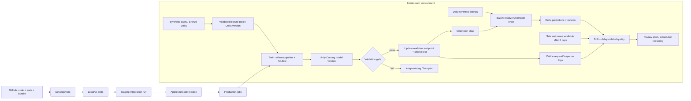

# Used-car MLOps on Azure Databricks

A runnable learning implementation with synthetic Indian car prices, managed Delta tables,
MLflow experiments, Unity Catalog model versions, validation gates, scheduled batch inference,
a real-time endpoint, request logging, monitoring, and rollback.

Workspace: [db-azure-workspace](https://adb-7405610390336981.1.azuredatabricks.net), East US,
Premium, serverless. The price unit is INR and distance is kilometres. Synthetic accuracy measures
how well the model learns our generator; it is not evidence of real-market pricing accuracy.

## How this follows the official architecture

The [official workflow and diagrams](https://learn.microsoft.com/en-us/azure/databricks/machine-learning/mlops/mlops-workflow)
separate development, staging tests, and production training/inference/monitoring.
This project promotes code across environments, trains a model in each, records experiment
evidence, and gates model deployment. Training and daily inference have separate failure domains.
This is a small implementation of that pattern, not a deployment of every optional platform service.



| Official diagram component | Our implementation | Where to inspect |
|---|---|---|
| Data/feature pipelines | `prepare`, `inputs`; schema and range checks; idempotent Delta MERGE | Catalog → schema → tables |
| Development and experiment tracking | chronological split; MLflow params, validation metrics, data input and Delta version | Experiments → `/Shared/used-car-mlops/dev` |
| Model registry | `used_car_price`, numbered versions, validation tags, Challenger/Champion/PreviousChampion aliases | Catalog → model |
| Model validation | MAE ≤ ₹150,000; MAPE ≤ 20%; beats training-median baseline; ≤ 2% MAE regression vs Champion on identical holdout | `validation.json` in MLflow run |
| Deployment workflow | prepare → train → validate → deploy; endpoint pins version explicitly | Jobs → `used-car-<env>-training` |
| Batch inference | inputs → batch; one resolved version per run; MERGE key includes car, date, version | Jobs → `used-car-<env>-batch` |
| Real-time inference | authenticated custom model endpoint, Small CPU, scale to zero; shared sklearn preprocessing | Serving → `used-car-<env>` |
| Monitoring | numeric-feature PSI, labeled MAE/RMSE/MAPE/R², request count/errors/execution latency | monitoring tables and monitoring job |
| CI/CD | repository tests plus an Azure-specific deployment workflow; identity setup is required before unattended CD | GitHub Actions |

### Environment boundary

We use one existing catalog, `db_azure_workspace`, and schemas `used_car_dev`,
`used_car_staging`, `used_car_prod`. This is logical separation in one personal workspace;
the same owner can access all three. It is not an enterprise security boundary. A company deployment
should assign service principals and explicit grants, and typically separate catalogs/workspaces.
The `prod` name here means the final stage of this synthetic demonstration.

### Feature store choice

All seven input features are supplied in each request. Preprocessing travels inside the MLflow
model, so an online feature lookup service is unnecessary for this first model. The `features`
table is a governed Delta table, not a declared Feature Engineering primary-key table.
If we later add regional market aggregates, compute them strictly before listing time and use
point-in-time feature lookups. Online serving then needs a corresponding online feature store.

## Run it yourself

Use Python 3.12 and the current Databricks CLI. Authentication uses your Azure workspace,
not the older AWS workspace.

```bash
python3.12 -m venv .venv
source .venv/bin/activate
pip install -r requirements.txt
pytest tests -q
databricks auth login --host https://adb-7405610390336981.1.azuredatabricks.net --profile used-car-azure
databricks workspace mkdirs /Shared/used-car-mlops -p used-car-azure
databricks bundle validate -t dev -p used-car-azure
databricks bundle deploy -t dev -p used-car-azure
databricks bundle run training -t dev -p used-car-azure
databricks bundle run daily_pipeline -t dev -p used-car-azure
python scripts/predict.py --endpoint used-car-dev
```

Notebook tasks install pinned dependencies and restart Python. The serverless notebook working
directory contains `task.py`, `workflow.py`, and `modeling.py`. No classic cluster or SQL warehouse
is required. Bundle state tracks the jobs and source files; schemas/tables/model versions/endpoints
are created by the workflows and are not automatically removed by bundle destruction.

Repeat the same commands with `-t staging`, then `-t prod`, after the previous environment passes.
Use a code commit SHA as the release identifier:

```bash
databricks bundle deploy -t prod -p used-car-azure --var release=<commit-sha>
databricks bundle run training -t prod -p used-car-azure
databricks bundle run daily_pipeline -t prod -p used-car-azure
python scripts/predict.py --endpoint used-car-prod
```

Defaults keep schedules paused. Once verified, enable only the production target:

```bash
databricks bundle deploy -t prod -p used-car-azure --var pause_status=UNPAUSED
```

The daily orchestration runs at 08:00 Asia/Kolkata and waits for batch completion before
starting monitoring. Weekly training runs Sunday at 07:00 Asia/Kolkata. A daily run can continue
using the previous approved model while training runs. Scale-to-zero endpoints can have cold-start
latency; disable scale to zero only when the latency requirement and ongoing budget justify it.
Serverless compute, serving, and storage incur Azure/Databricks charges.

## Your first hands-on learning sequence

1. **Open `modeling.py`.** Follow the seven input columns through the column transformer and
   log-target regressor. The target, identifier, and event date never enter the model as features.
2. **Run preparation.** Inspect `bronze_sales` and `features`. We generate 5,000 repeatable sales.
   Open Delta history and note the version passed to training. Training reads that exact snapshot.
3. **Open the experiment run.** Compare validation metrics with the final held-out test metrics.
   The train/validation/test split is chronological (70/15/15). The fixed test set is sufficient
   for this demonstration; repeated business decisions should use refreshed temporal holdouts.
4. **Inspect the model version.** Its signature lists the features and types. Find `release`,
   `data_version`, and `validation` tags. Challenger means a candidate passed; Champion is the
   batch production pointer. Serving uses the explicit numeric version.
5. **Follow the task graph.** A failed gate prevents deploy. Check the `validation.json` artifact
   to learn exactly which criterion failed. Do not relax a threshold simply to make the job green.
6. **Send a real-time request.** `scripts/predict.py` validates inputs and uses OAuth. Try changing
   age or mileage for the same vehicle; examine the returned INR estimate.
7. **Run the daily pipeline twice for the same date.** Query the duplicate check below. The
   compound key prevents duplicate predictions for the same car/date/model version.
8. **Open monitoring.** Data drift is a distribution change, not proof of an inaccurate model.
   Accuracy is measured only after a sale label becomes available. `outcomes.available_date`
   models a two-day reporting delay; no sale price enters the inference inputs.
9. **Practice rejection locally.** `test_rejected_candidate_and_contract` checks bad data and a
   worse candidate. Change only test fixtures to see how checks protect the approved model.
10. **Practice a reviewed release.** Change code on a branch, run tests, validate staging,
    inspect metrics, then release the same code to production. Never copy a locally trained model
    silently over the registered production version.

### Useful SQL (run in a notebook with `%sql`)

```sql
SELECT car_id, prediction_inr, model_version, scoring_date
FROM db_azure_workspace.used_car_prod.predictions LIMIT 20;

SELECT car_id, scoring_date, model_version, count(*) AS n
FROM db_azure_workspace.used_car_prod.predictions
GROUP BY car_id, scoring_date, model_version HAVING count(*) > 1;

SELECT * FROM db_azure_workspace.used_car_prod.monitoring ORDER BY monitor_date DESC;
SELECT * FROM db_azure_workspace.used_car_prod.online_monitoring ORDER BY monitor_date DESC;
SELECT * FROM db_azure_workspace.used_car_prod.online_payload LIMIT 10;
DESCRIBE HISTORY db_azure_workspace.used_car_prod.features;
```

## Operations and limitations

- **Rollback:** `python scripts/rollback.py --environment prod --version <passed-version>`.
  This updates online serving and then the Champion alias. These two systems are not atomic;
  pause promotion during incidents and verify both after a failure. `deploy` compensates online
  failures by restoring the previous approved online version when one exists.
- **Serving succeeded, alias update failed:** the deployment task fails; inspect the live endpoint
  version and the alias. Repair deployment or explicitly roll both back. Do not assume alias
  edits update serving.
- **Monitoring job fails:** inspect `alerts_json` and data freshness. Monitoring does not
  automatically promote or retrain based on a noisy drift signal. Weekly retraining remains gated.
- **Delayed online logs:** endpoint logging is asynchronous. An empty request table can mean no
  traffic or delivery delay. Online monitoring covers operational metrics; matching real-time
  requests to eventual sale outcomes requires a business request-to-car identifier mapping.
- **Scale:** small tables are collected to pandas deliberately (5,000 training rows). For a
  marketplace workload, replace bounded demo scoring with distributed inference, use incremental
  ingestion, and limit monitoring windows. The demo input table grows by 100 vehicles per day.
- **Data refresh:** training currently reuses an immutable synthetic reference feed. Real
  retraining must ingest newly available labeled transactions, preserve snapshots, and backtest
  on a later window. Scheduled execution alone does not make the model learn new information.
- **Security/CI:** personal interactive identity is used for the learning deployment. Configure
  a dedicated least-privilege deployment identity before treating this as business production.

For the original Azure workspace creation steps, see the separate `azure-databricks-setup`
guide delivered with this project. For release and recovery commands, see `docs/release-runbook.md`.

Additional official references: [bundle jobs](https://learn.microsoft.com/en-us/azure/databricks/dev-tools/bundles/jobs-tutorial),
[MLOps Stacks](https://learn.microsoft.com/en-us/azure/databricks/dev-tools/bundles/mlops-stacks),
[model serving](https://learn.microsoft.com/en-us/azure/databricks/machine-learning/model-serving/create-manage-serving-endpoints),
[inference logging](https://learn.microsoft.com/en-us/azure/databricks/ai-gateway/inference-tables-serving-endpoints).
